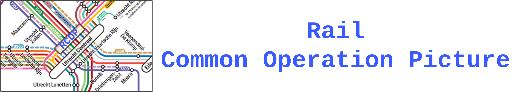

Currently working on:
- [ ] 1a. Change 1km nearby railsegments FIELD 'status' from TRUE to FALSE lay them over real-time traffic density. (Mate or Jhon after 1e-f)
- [ ] 1b. Send **GEOFENCING** on the segments that 'status' are FALSE. Send alert when other trains come across them.  (Mate or Jhon after 1e-f)
- [ ] 1c. Calculate estimated driving time from current ambu to this 'accident_location' based on Tomtom API. **Move code into the consumer** (Xiaolu)
- [ ] 1d. Fix bug with having to refresh the button (should be fixed by completing 1c). (Xiaolu)
- [ ] 1e. Update severity field. (Jhon)
- [ ] 1f. Create a pop-up at the stopped train upon pressing the button/update incident information window. (Jhon)
- [ ] 1g. Fix bug with trains stopping at the border of the study area. (Thijs)
- [ ] 1h. Add more simulated ambulances. (Falco)
---

Requirements:  
- [ ] 2a. Set realistic speed when an ambulance is driving towards incident location.
- [ ] 2b. Estimated Time of Arrival of ambulance to incident location

---
Other tasks:
- [ ] 3. Write doc to explain mock-up data file:  
- [ ] 4. Link charts and graphs to data on the map.
- [ ] 5. Send multiple ambulances to incident location based on severity.

---

# 🚆 RCOP 

<div align="center">
  
</div>

Welcome to **RCOP**, a powerful tool for monitoring the accident response operations at Utrecht Centraal Railway Station in simulation.

RCOP is an open source Rail Common Operation Picture toolbox based on a series of open source data-handling tools. You can also consider this a minimal integration of traffic monitoring dashboard built on [Apache Kafka](https://kafka.apache.org/), [TIle38](https://tile38.com/), [Streamlit](https://streamlit.io/), [Mapbox](https://www.mapbox.com/). 

## 🛠 Installation


Follow these simple steps to set up the system:

1. Clone the repository:
  ```bash
  git https://github.com/drestrepoj06/CGI-COP-WUR.git
  ```
2. Navigate to the project folder:
  ```bash
  cd CGI-COP-WUR
  ```
3. Launch the service using Docker:
  ```bash
  docker compose up
  ```

🚀 Then open localhost:8501 to start monitoring the lovely Railway Station **Utrecht Centraal**.

## 🤝 Contributors

Xiaolu Yan, Jhon Restrepo, Falco Latour, Máté Török, Thijs Vons​

<div align="center">
  
  
  
  
  
</div>

The RCOP project was made possible with the help of many:

- `Robert Voûte`, `Albert Jan van der Werp`, `Hessel Prins` from CGI
- `Sytze de Bruin`, `Jascha Grübel` from WUR-GRS
